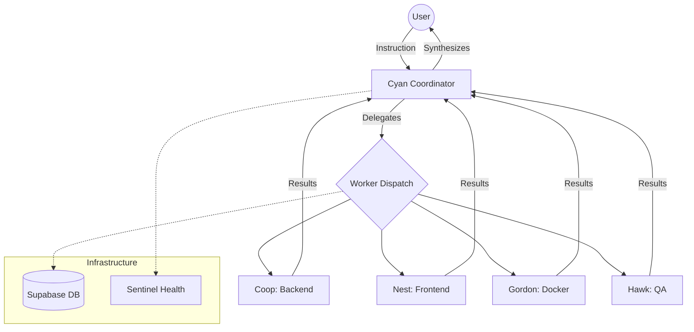

# Antigravity Multi-Agent Orchestrator 🛸

**Antigravity** is a high-performance, persona-based AI orchestration system. It is designed to handle the entire lifecycle of web application development—from architecture and backend logic to premium UI/UX and containerized deployment.


## 🌌 Core Pillars

### 🧩 Specialized Intelligence
Antigravity utilizes a fleet of specialized AI agents, coordinated by the **Cyan (Architect)** persona:
- **Cyan**: Lead Coordinator & Architect.
- **Coop**: Backend & logic specialist (Node.js/Prisma).
- **Nest**: UI/UX Master (React/CSS-HSL).
- **Gordon**: Official Docker AI Specialist.
- **Hawk**: QA & skeptical testing engineer.
- **Loft**: DevOps & Infrastructure.
- **Piper**: Brand & Content lead.

### 💎 Premium Aesthetics
Built with a "Glassmorphism 2.0" design system using React, Vite, and Framer Motion for a state-of-the-art interactive experience.

### 🛡️ Industrial Robustness
- **Technical Retry Logic**: Automated worker task retries on engine failures.
- **Persistence**: Full conversation and task tracking powered by Supabase.
- **Sentinel**: Real-time intelligence provider health monitoring (OpenRouter/Groq).

---

## 🏗️ Architecture



---

## 🚀 Getting Started

### 1. Prerequisites
- Node.js (v18+)
- Local Docker Environment (for Gordon tools)
- Supabase account (PostgreSQL)

### 2. Installation
```bash
git clone https://github.com/zenitdtc-wq/antigravity-agent.git
cd antigravity-agent

# Install dependencies
cd client && npm install
cd ../server && npm install
```

### 3. Configuration
Create a `.env` file in the root directory:
```env
OPENROUTER_API_KEY=your_key
GROQ_API_KEY=your_key
SUPABASE_PASSWORD=your_database_password
```

### 4. Database Setup
Run the SQL found in `supabase_schema.sql` in your Supabase SQL Editor.

### 5. Launch
- **Backend API**: `cd server && node index.js`
- **Frontend UI**: `cd client && npm run dev`

---

## 📜 License
This project is licensed under the ISC License.

Developed with 🤍 by the **Antigravity AI Team**.
